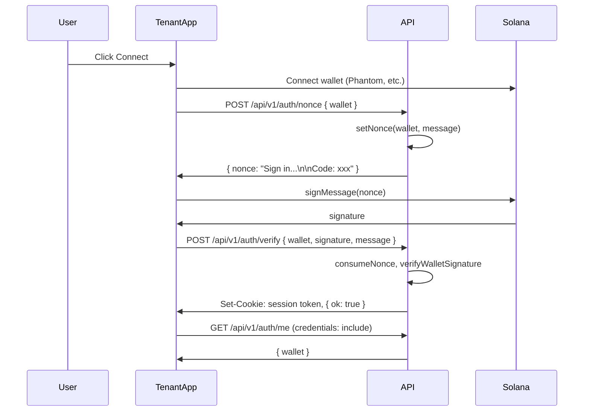
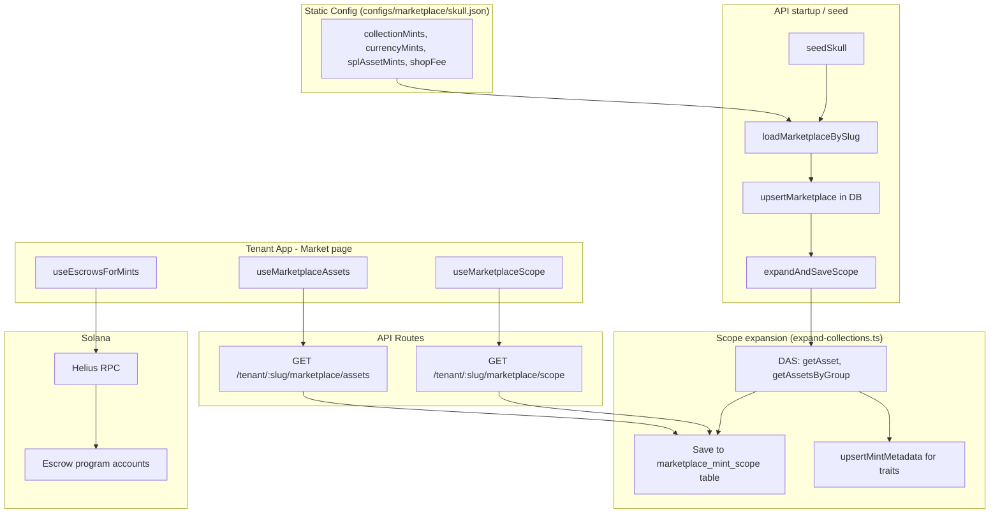

# DecentraGuild Architecture Overview

Quick reference for project structure, data flow, and how pieces connect.

---

## High-Level System

```
+------------------+     +------------------+     +------------------+
|   Tenant App     |     |   Platform App   |     |   Backend API    |
|  (apps/tenant)   |     | (apps/platform)  |     |   (apps/api)     |
|                  |     |                  |     |                  |
| skull.dguild.org |     | dguild.org       |<--->| localhost:3001   |
| One deploy,      |     | Discovery,       |     | Fastify, CORS   |
| all tenants      |     | onboarding       |     | Postgres         |
+--------+---------+     +------------------+     +--------+---------+
         |                                                       |
         |  fetch(tenant-context, marketplace/*, auth/*)         |
         +-------------------------------------------------------+
                                    |
                                    v
         +-------------------------------------------------------+
         |              Solana RPC (Helius)                       |
         |  Escrow program accounts, DAS (getAsset, getAssetsByGroup)  |
         +-------------------------------------------------------+
```

---

## Repo Layout

```
Platform/
  apps/
    api/          # Backend: Fastify, Postgres, tenant/marketplace/auth routes
    tenant/       # dGuild portal – one app, all tenant subdomains
    platform/     # Discovery, onboarding, org creation (dguild.org)
  packages/
    core/         # Tenant resolver (host -> slug), config types, browser-safe exports
    ui/           # Shared Vue components, design system, theme
    web3/         # Wallet connection, Solana RPC, escrow fetch, auth sign-in
    auth/         # AuthWidget, useAuth (wallet + session)
    contracts/    # Solana programs (Anchor), IDLs
  configs/
    tenants/       # Static JSON per tenant (skull.json, etc.)
    marketplace/  # Marketplace config per tenant (skull.json = collections, currencies)
```

---

## Tenant Resolution Flow

Tenant identity comes from **host** (subdomain) or **query param** (`?tenant=slug`).

```mermaid
flowchart TD
    subgraph Browser["Browser / Tenant App"]
        A[Request: skull.dguild.org or localhost?tenant=skull]
    end

    subgraph SSR["tenant.server.ts (SSR)"]
        B[getTenantSlugFromHost]
        B --> C[Set slug in Pinia store]
    end

    subgraph Client["tenant.client.ts (Client)"]
        D[getTenantSlugFromHost]
        D --> E[fetchTenantContext(slug)]
        E --> F[GET /api/v1/tenant-context?slug=skull]
    end

    subgraph API["API"]
        G[tenant-context route]
        G --> H{DB available?}
        H -->|yes| I[getTenantBySlug from DB]
        H -->|no| J[loadTenantBySlug from configs/tenants]
        I --> K[tenant found?]
        J --> K
        K -->|yes| L[Load marketplace config if marketplace.active]
        K -->|no| M[404]
        L --> N[Return tenant + marketplaceSettings]
    end

    A --> B
    A --> D
    F --> G
```

**Resolver logic** (`packages/core/src/resolver.ts`):

- `*.dguild.org` → subdomain = slug (e.g. `skull.dguild.org` → `skull`)
- `?tenant=X` overrides host
- `localhost` / `127.0.0.1` → no slug (dev uses `skull` via plugin fallback)

---

## Auth Flow (Wallet Sign-In)



- **Session**: httpOnly cookie, verified JWT
- **Admin check**: `tenant.admins` array includes `wallet`

---

## Marketplace Data Flow



**Key composables on Market page**:

| Composable | Data source | Purpose |
|------------|-------------|---------|
| `useMarketplaceScope(slug)` | `GET /api/v1/tenant/:slug/marketplace/scope` | List mints in scope, entries with `collectionMint` for grouping |
| `useMarketplaceAssets({ slug, page, collection, search })` | `GET /api/v1/tenant/:slug/marketplace/assets` | Paginated assets with metadata (name, symbol, image, traits) |
| `useEscrowsForMints(mintsSet, rpcUrl)` | Solana RPC + escrow program | Real offer/request counts per mint |

---

## API Routes Summary

| Path | Method | Auth | Purpose |
|------|--------|------|---------|
| `/api/v1/tenant-context` | GET | no | Tenant config + marketplaceSettings (slug from query or Host) |
| `/api/v1/auth/nonce` | POST | no | Get sign-in nonce for wallet |
| `/api/v1/auth/verify` | POST | no | Verify signature, set session cookie |
| `/api/v1/auth/me` | GET | cookie | Current wallet |
| `/api/v1/auth/logout` | POST | no | Clear session cookie |
| `/api/v1/tenant/:slug/marketplace/scope` | GET | no | Scope entries (mints, source, collectionMint) |
| `/api/v1/tenant/:slug/marketplace/assets` | GET | no | Paginated assets with metadata |
| `/api/v1/tenant/:slug/marketplace/scope/expand` | POST | no (dev only) | Expand collections via DAS → DB |
| `/api/v1/marketplace/metadata/mint/:mint` | GET | no | Cached mint metadata (DB or RPC fetch) |
| `/api/v1/tenant/:slug/marketplace/metadata/refresh` | POST | admin | Refresh metadata for mints from chain |
| `/api/v1/tenant/:slug/settings/*` | * | admin | Tenant settings CRUD |

---

## Database Tables (Postgres)

| Table | Purpose |
|-------|---------|
| `tenant_config` | Cached tenant config (id, slug, name, branding, modules, admins) |
| `marketplace_settings` | Marketplace config per tenant (collections, currencies, shopFee) |
| `marketplace_mint_scope` | Which mints are in scope per tenant (mint, source, collection_mint) |
| `mint_metadata` | Cached metadata (name, symbol, image, decimals, traits) |

---

## Module Routing (apps/tenant)

| Module id | Route | Label | Implemented |
|-----------|-------|-------|-------------|
| admin | `/admin` | Admin | yes |
| marketplace | `/market` | Market | yes |
| raffles | `/raffle` | Raffle | no |
| whitelist | `/whitelist` | Whitelist | no |
| minting | `/mint` | Mint | no |

Nav shows only **enabled + implemented** modules. Admin tab only if `tenant.admins` includes connected wallet.

---

## Plugin Order (Nuxt)

```
buffer.server  → Polyfill Buffer for SSR (Solana/Anchor need it)
tenant.server  → Set slug from host (SSR)
buffer.client  → Polyfill Buffer for client
tenant.client  → Fetch tenant context from API
@decentraguild/auth/plugin.client → Init auth, fetch /auth/me
```

The market shell (MarketBrowseView, MarketOpenTradesView, EscrowDetailModal) is lazy-loaded (ClientOnly + defineAsyncComponent) so web3/Buffer code never runs during SSR; avoids "Buffer is not defined" on direct /market links.

---

## Config Sources (Priority)

1. **Database** (Postgres) – when `DATABASE_URL` is set
2. **Static JSON** – `configs/tenants/{slug}.json`, `configs/marketplace/{slug}.json`

API prefers DB; falls back to file if DB empty or unavailable.
