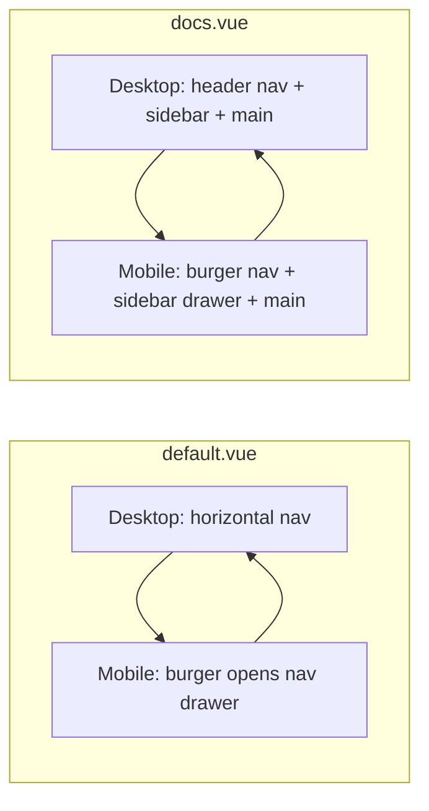

# Platform shell mobile audit

Audit of the DecentraGuild platform app shell (dguild.org) for mobile and responsive behaviour. Scope: header, nav, columns, and content shells only. Tenant app and in-tenant modules are out of scope.

---

## 1. Baseline review of current platform layouts

### app.vue

- Root only renders `<NuxtLayout>` and `<NuxtPage>`. No shell behaviour or global styles; layout is fully delegated to the selected layout (default or docs).

### default.vue

- **Structure:** `.platform-layout` (min-height 100vh, theme bg/text). Header `.platform-header`: flex, space-between, min-height 56px, padding `0 var(--theme-space-xl)` (2rem). Left block: brand (logo img + "DecentraGuild" text) + `<nav class="platform-header__nav">` with three NuxtLinks (Modules, Discover, Create org). Right block: `AuthWidget`. Main: `.platform-main` with padding `var(--theme-space-xl)` and default slot.
- **CSS:** All layout is flex. No media queries. Header left uses `gap: var(--theme-space-xl)`; nav uses `gap: var(--theme-space-lg)`. Brand and nav are in one flex row; on narrow widths they will squeeze or wrap.
- **Red flags for mobile:**
  - Fixed horizontal padding (xl) on both header and main can eat a lot of width on 320–430px.
  - Nav items (Modules, Discover, Create org) + brand + AuthWidget in one row: at ~360px the row will wrap or overflow; no burger/mobile menu.
  - No tap-target sizing (min 44px) considered for nav links.
  - Main content has no max-width or responsive padding; on very wide screens content can be overly wide (conversely on mobile the padding is not reduced).

### docs.vue

- **Structure:** Same `.platform-layout` with `.docs-layout` modifier. Header: brand (text-only "DecentraGuild") + nav (Docs, Discover, Create org, AuthWidget inline). Body: `.docs-body` flex row with `.docs-sidebar` (260px fixed width, `DocsSidebar`) and `.docs-main` (flex: 1, padding 2xl, max-width 800px, overflow-x: hidden).
- **CSS:** `.docs-sidebar` is `width: 260px; flex-shrink: 0`. No media queries. Two-column layout is always on.
- **Red flags for mobile:**
  - Sidebar 260px + main content: on 320–430px the sidebar alone is most of the viewport; horizontal scroll or crushed main content.
  - Header nav (Docs, Discover, Create org, AuthWidget) in one row: same overflow/wrap issues as default.
  - `min-height: calc(100vh - 56px)` on docs-body is fine; the issue is the fixed sidebar width and no mobile pattern (drawer or collapsible).

---

## 2. Current responsive model and breakpoints

### Design tokens (vars.css)

| Token | Value |
|-------|--------|
| `--theme-breakpoint-xs` | 480px |
| `--theme-breakpoint-sm` | 640px |
| `--theme-breakpoint-md` | 768px |
| `--theme-breakpoint-lg` | 1024px |
| `--theme-breakpoint-xl` | 1280px |

### AppShell.vue (tenant shell)

- **Desktop:** `min-width: var(--theme-breakpoint-md)` — nav is a visible sidebar (min-width 12rem).
- **Mobile:** `max-width: var(--theme-breakpoint-md)` — nav becomes fixed off-canvas drawer (width 280px, max-width 85vw), overlay behind it, close button inside nav; open state via `mobileNavOpen` and class `app-shell--nav-open`.

Platform shell currently uses no breakpoints and does not use `AppShell`.

### Breakpoint policy for platform shell

- **Mobile:** `max-width: var(--theme-breakpoint-sm)` (640px) — single column, header with burger; nav in drawer; docs sidebar in drawer or collapsed.
- **Tablet:** `min-width: var(--theme-breakpoint-sm)` and `max-width: var(--theme-breakpoint-md)` — optional: still burger + drawer for nav to avoid crowding; docs can keep sidebar visible but narrower if desired.
- **Desktop:** `min-width: var(--theme-breakpoint-md)` (768px) — horizontal nav in header; docs two-column layout with sidebar visible.

Using `--theme-breakpoint-md` for “nav becomes horizontal” aligns with tenant `AppShell` (768px). Using `sm` for “definitely mobile” gives a clear phone vs tablet boundary.

### Decision: AppShell vs custom header+main

- **Recommendation:** Keep platform shell as a **custom header + main** (no `AppShell`). Platform has a single top bar and no left nav on desktop; tenant has header + left nav. Reuse **patterns** from AppShell (overlay, drawer, `mobileNavOpen`-style state, same breakpoint md for “drawer vs inline”) so behaviour feels consistent, but implement them in platform layout and docs layout rather than slotting into AppShell.

---

## 3. Failure modes by layout

### default.vue

| Viewport | Failure / risk |
|----------|------------------|
| 320px | Header left (brand + 3 nav links) + right (AuthWidget) overflow or wrap; nav links and AuthWidget become cramped or wrap to two lines; tap targets may be too small. |
| 375px | Same as 320px; padding xl both sides leaves little room for nav. |
| 414px | Slightly better but still tight; no dedicated mobile nav. |
| 640–768px | Nav may fit but tight; no explicit tablet treatment. |
| 768px+ | Current layout is acceptable. |

### docs.vue

| Viewport | Failure / risk |
|----------|------------------|
| 320px | Sidebar 260px + main: main gets ~60px or forces horizontal scroll. Header nav (4 items) overflows or wraps. |
| 375px | Same: 260px sidebar dominates; main content unreadable or scrolls horizontally. |
| 414px | Same. |
| 640–768px | Sidebar + main can fit but sidebar still takes a large share; no responsive sidebar behaviour. |
| 768px+ | Two-column layout acceptable. |

---

## 4. Target mobile behaviours

### default.vue — mobile header and nav

- **Breakpoint:** At `max-width: var(--theme-breakpoint-md)` (768px): hide inline nav; show a single “menu” (burger) button that toggles an off-canvas nav drawer.
- **Drawer:** Same pattern as AppShell: overlay (dismiss on click), drawer from left (e.g. 280px, max-width 85vw), close button inside. Nav links (Modules, Discover, Create org) and optionally AuthWidget (or keep AuthWidget in header as icon-only) inside the drawer. State: e.g. `mobileNavOpen`; class on layout root when open for overlay + drawer visibility.
- **AuthWidget:** Prefer keeping in header on mobile (icon-only or compact) so users can sign in without opening the menu; if it does not fit, move into the drawer.
- **Main:** Reduce horizontal padding on small screens (e.g. `var(--theme-space-md)` below `sm`) so content is not cramped; ensure no horizontal scroll.

### docs.vue — mobile header and docs layout

- **Header:** Same as default: at `max-width: var(--theme-breakpoint-md)` use burger + drawer for primary nav (Docs, Discover, Create org, AuthWidget or compact AuthWidget in header).
- **Sidebar:** At `max-width: var(--theme-breakpoint-md)` hide the fixed sidebar from the flow. Expose a “Docs menu” / “On this page” control (e.g. button in docs header or top of main) that toggles a second drawer (or the same drawer with a different content slot) containing `DocsSidebar`. So: two drawers possible (main nav, docs TOC) or one drawer that shows nav on non-docs pages and docs TOC on docs pages (simpler). Recommend **one drawer per layout**: default layout = nav drawer; docs layout = nav in header drawer + docs sidebar in its own drawer (or combined “menu” that shows both nav and doc sections).
- **Docs main:** Full width below header when sidebar is hidden; keep padding (e.g. `var(--theme-space-md)` on mobile) and `max-width: 800px` for readability on large screens.

State diagram (conceptual):

---

## 5. Concrete CSS and structural changes

### default.vue

**Template / structure:**

- Add a burger button (icon only, e.g. `mdi:menu`) in the header, visible only below `md`, that toggles `mobileNavOpen`. Use `aria-expanded` and `aria-label="Open menu"` / `"Close menu"`.
- Wrap current nav links in a container that:
  - Above `md`: visible inline in header (current behaviour).
  - Below `md`: not in header; rendered in a drawer (same overlay + slide-in panel pattern as AppShell). Drawer markup can live in default.vue (e.g. overlay + aside with nav links + close button).
- Keep AuthWidget in `.platform-header__right`; ensure it stays visible on mobile (compact or icon-only if needed).

**State:**

- `const mobileNavOpen = ref(false)`. Toggle from burger and from close button in drawer. On overlay click, set to false. On NuxtRoute change, set to false (close drawer when navigating).

**CSS (use existing tokens):**

- Root: add class when `mobileNavOpen` (e.g. `platform-layout--nav-open`) for overlay and drawer visibility.
- Media `(max-width: var(--theme-breakpoint-md))`:
  - Hide `.platform-header__nav` in the header (display: none or move nav into drawer in template so header nav is empty on mobile).
  - Show burger button.
  - Reduce `.platform-header` and `.platform-main` padding to `var(--theme-space-md)` if needed (or keep xl for header and use md for main).
- Drawer: fixed position, left 0, top 0, bottom 0, width 280px, max-width 85vw, z-index above overlay; transform translateX(-100%); when open translateX(0). Overlay: fixed inset 0, z-index below drawer, background rgba(0,0,0,0.5). Transitions on transform and opacity.
- Ensure nav links and close button have min height/click area ~44px for touch.

**Classes (examples):**

- `platform-header__burger`, `platform-nav-drawer`, `platform-nav-drawer__close`, `platform-layout__overlay`.

### docs.vue

**Template / structure:**

- Same header pattern as default: burger + drawer for “Docs”, “Discover”, “Create org” (and AuthWidget or in-drawer). So reuse the same idea: below `md`, header shows brand + burger + AuthWidget; nav links in drawer.
- Below `md`: hide `.docs-sidebar` from layout flow (display: none or remove from flow). Add a “Docs menu” / “Contents” button that toggles a **sidebar drawer** (second overlay + panel) containing `DocsSidebar`. So: two toggles on mobile — one for main nav, one for docs TOC.
- State: `mobileNavOpen`, `docsSidebarOpen`. Or one “menu” open at a time: when opening docs sidebar, close nav drawer and vice versa.

**CSS:**

- Media `(max-width: var(--theme-breakpoint-md))`:
  - Header: same as default (burger, hide inline nav, drawer for nav).
  - `.docs-body`: flex-direction column (stack main only; sidebar not in flow).
  - `.docs-sidebar`: fixed drawer (e.g. right: 0 or left: 0), width 280px max-width 85vw, transform translateX(-100%) (if left) or translateX(100%) (if right); when `docsSidebarOpen` translate 0. Overlay for docs sidebar (separate or shared; if shared, only one drawer open at a time).
  - `.docs-main`: full width, padding `var(--theme-space-md)`.
- Desktop: keep current flex row and 260px sidebar; optionally use `var(--theme-breakpoint-md)` to avoid fixed 260px below md.

**Classes (examples):**

- `docs-layout--nav-open`, `docs-layout--sidebar-open`, `docs-sidebar-drawer`, `docs-sidebar-drawer__close`.

### Shared vs local

- **Local to platform:** Burger icon, platform header structure, platform nav drawer, docs sidebar drawer. These are layout-specific.
- **Reusable in packages/ui (optional later):** A generic “Drawer” or “OverlayNav” component (slot for content, open state, overlay + panel with close) could be added and used by both tenant AppShell and platform layouts to reduce duplication. Not required for Phase 1; document as Phase 3 if desired.

---

## 6. Alignment with shared components

- **Breakpoints:** Use only `var(--theme-breakpoint-*)` from `packages/ui/src/theme/vars.css`. Use `md` (768px) for “drawer vs horizontal/sidebar” so platform and tenant behave similarly at the same width.
- **Patterns:** Reuse overlay + fixed drawer + close button + `open` state and class on root, as in AppShell. No new breakpoint values.
- **No AppShell usage:** Platform does not use `<AppShell>`; it keeps its own simpler header + main (and docs layout adds sidebar). Consistency is in behaviour (drawer at md, same tokens), not in sharing the same component.

---

## 7. Manual QA checklist (mobile)

Use browser DevTools device emulation or real devices. Test both default and docs layouts.

### Widths to test

- 320px (e.g. iPhone SE)
- 375px (e.g. iPhone 12/13/14)
- 414px (e.g. iPhone Plus)
- 768px (tablet portrait)
- 1024px+ (desktop)

### Default layout

- [ ] At 320px, 375px, 414px: no horizontal scroll on page or header.
- [ ] At 320px, 375px, 414px: header shows brand and a menu (burger) button; main nav links are not visible inline (they are in drawer).
- [ ] Tapping burger opens drawer; nav links (Modules, Discover, Create org) are in drawer and usable.
- [ ] Tapping overlay or close button closes drawer.
- [ ] After navigating via a drawer link, drawer closes (or document this if we keep it open).
- [ ] AuthWidget is visible and usable (in header or in drawer).
- [ ] Main content has readable padding and no horizontal scroll.
- [ ] At 768px and above: horizontal nav visible, no burger; drawer behaviour not visible.

### Docs layout

- [ ] At 320px, 375px, 414px: no horizontal scroll; sidebar is not visible as a fixed column (it is in a drawer or hidden until opened).
- [ ] A control (e.g. “Contents” or “Docs menu”) opens the docs sidebar in a drawer; closing overlay or close button closes it.
- [ ] Docs main content is full width and readable; no horizontal scroll.
- [ ] At 768px and above: sidebar visible as column; docs main and sidebar layout as today.

### General

- [ ] Tab order: burger, close buttons, nav links, AuthWidget are focusable; focus visible.
- [ ] Tap targets: buttons and links have at least ~44px effective touch area where possible.

---

## 8. Phased implementation roadmap

### Phase 1: Default layout header and nav (default.vue)

- Add `mobileNavOpen` state and burger button; show burger and hide inline nav below `md`.
- Add overlay + nav drawer with nav links and close button; open/close from burger, overlay, close, and on route change.
- Reduce main padding on small screens (e.g. `md` below breakpoint).
- Files: `apps/platform/src/layouts/default.vue`.
- Done when: QA checklist for default layout at 320 / 375 / 414 / 768px passes.

### Phase 2: Docs layout header, nav, and sidebar (docs.vue)

- Reuse same header/nav mobile pattern as default (burger + nav drawer).
- Hide fixed `.docs-sidebar` below `md`; add “Contents” / “Docs menu” button and docs sidebar drawer (overlay + panel with `DocsSidebar` + close). State `docsSidebarOpen`; optionally ensure only one of nav drawer or docs drawer is open at a time.
- Make `.docs-body` single column on mobile; `.docs-main` full width with responsive padding.
- Files: `apps/platform/src/layouts/docs.vue`.
- Done when: QA checklist for docs layout at 320 / 375 / 414 / 768px passes.

### Phase 3 (optional): Shared drawer primitive

- If we want to DRY overlay + drawer behaviour across tenant AppShell and platform: add a small component in `packages/ui` (e.g. `Drawer` or `OverlayPanel`) and refactor platform (and optionally tenant) to use it. Same breakpoints and behaviour. Document in this file when done.

---

## Summary

- **Current state:** Platform default and docs layouts are desktop-only flex layouts with no media queries; header nav and docs sidebar break on narrow viewports (overflow, wrap, or unusable main content).
- **Target state:** Below 768px (`--theme-breakpoint-md`), header shows brand + burger + AuthWidget; main nav and (on docs) doc sidebar move into off-canvas drawers with overlay and close. Main content gets responsive padding and no horizontal scroll.
- **Alignment:** Same breakpoint tokens and drawer/overlay pattern as tenant AppShell; platform keeps its own layout components.
- **Delivery:** This document is the audit and spec; implementation follows Phases 1 and 2 (and optionally 3) above.
